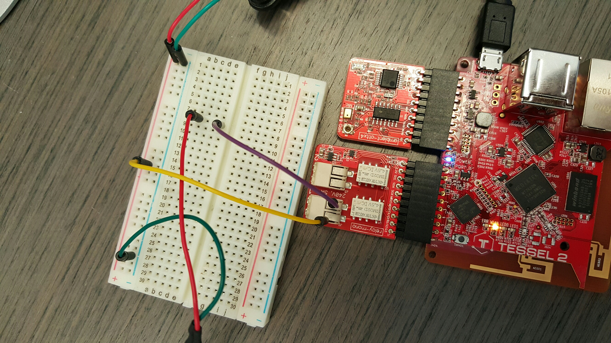

# node-activate-light
Make something happen when the lights come on
 *   Tessel based light activated action, such as turning on a fan via relay
 *   _Remeber to run `npm install` in this project repo to get all the dependencies_

---

#### Parts used:
- [Tessel 2](https://tessel.io/) 
  
- [Ambient module](https://tessel.io/modules#module-ambient) 
  
- [Relay module](https://tessel.io/modules#module-relay) 
  

#### NPM Software modules used:
- [node-static](https://www.npmjs.com/package/node-static) - simple web server to demonstrate project
- [os](https://www.npmjs.com/package/os) - used to get the server IP address and return it to a client
- [tessel](https://www.npmjs.com/package/tessel) - cannot live without it ;)
- [ambient-attx4](https://www.npmjs.com/package/ambient-attx4) - lets you read and act upon sound and light levels
- [relay-mono](https://www.npmjs.com/package/relay-mono) - try turning on a rotating light/etc.
- [tessel-toggle-power](https://www.npmjs.com/package/tessel-toggle-power) - toggles a relay module, or specified pin *(wire up your own relay and trigger it)*

--

## Instructions

1. Plug your Ambient module into port A
2. Plug your Relay module into port B 
    Then wire something to the relay channel 1 or 2 (or both) 
    Alternately you could toggle pins as mentioned above
3. `t2 list` to make sure your Tessel is connected, then run `t2 run app.js`
4. Your T2 app will noisily output console logs (notice `DEBUG = true`)
5. Shine your cell phone light onto the relay, then experiment with the trigger-level

*So now the question is, what else can you do with this?! :)*

--

_Made with ♥ by CAA_
